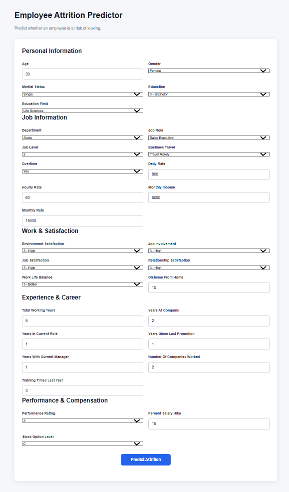
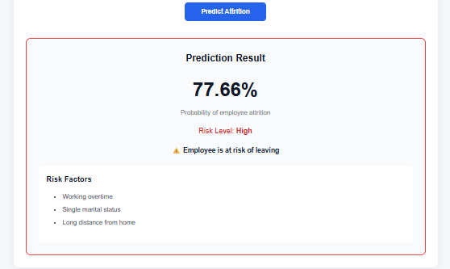

# Employee Attrition Predictor

A full-stack machine learning application that predicts the probability of employee attrition based on employee and job-related information.

The project combines a **Machine Learning model**, **FastAPI backend**, and **React + TypeScript frontend** to provide an interactive employee attrition prediction experience.

## 📸 Screenshots

### Prediction Form



### Prediction Result



## 🚀 Features

* Predict employee attrition risk using a trained Machine Learning model
* Interactive React-based prediction form
* REST API built with FastAPI
* Probability-based attrition prediction
* Data preprocessing and feature transformation
* Machine Learning model trained using employee HR data
* Responsive and user-friendly interface
* Frontend and backend separated into independent applications

## 🛠️ Tech Stack

### Machine Learning

* Python
* Pandas
* NumPy
* Scikit-learn
* Logistic Regression

### Backend

* Python
* FastAPI
* Pydantic
* Uvicorn

### Frontend

* React
* TypeScript
* Vite
* CSS

## 🧠 Machine Learning

The model was trained using an employee attrition dataset containing employee demographic, job, compensation, and service-related information.

### Machine Learning workflow

```text
Dataset
   ↓
Data Cleaning
   ↓
Exploratory Data Analysis
   ↓
Feature Engineering
   ↓
Categorical Encoding
   ↓
Train/Test Split
   ↓
Model Training
   ↓
Model Evaluation
   ↓
Prediction API
```

### Model

A **Logistic Regression** model was used for employee attrition prediction.

The model achieved an ROC-AUC score of approximately **0.84**, indicating good ability to distinguish between employees likely to leave and employees likely to stay.

## 📊 Prediction

The application returns an attrition probability for the employee.

Example:

```json
{
  "attrition_probability": 0.776
}
```

The probability can then be presented to the user through the frontend prediction result.

## 🏗️ Project Architecture

```text
React + TypeScript Frontend
          │
          │ HTTP Request
          ▼
      FastAPI Backend
          │
          ▼
Preprocessing Pipeline
          │
          ▼
Machine Learning Model
          │
          ▼
   Attrition Probability
          │
          ▼
      Frontend Result
```

## 📁 Project Structure

```text
employee-attrition-predictor/
│
├── backend/
│   ├── main.py
│   ├── requirements.txt
│   └── model files
│
├── frontend/
│   ├── src/
│   ├── public/
│   ├── package.json
│   └── ...
│
├── screenshots/
│   ├── prediction-form.png
│   └── prediction-result.png
│
└── .gitignore
```

## ⚙️ Running the Backend

Navigate to the backend directory:

```bash
cd backend
```

Create and activate a virtual environment:

```bash
python -m venv venv
```

Windows:

```bash
venv\Scripts\activate
```

Install dependencies:

```bash
pip install -r requirements.txt
```

Start the FastAPI server:

```bash
uvicorn main:app --reload
```

The backend will be available at:

```text
http://127.0.0.1:8000
```

FastAPI documentation:

```text
http://127.0.0.1:8000/docs
```

## 💻 Running the Frontend

Open a new terminal and navigate to the frontend:

```bash
cd frontend
```

Install dependencies:

```bash
npm install
```

Start the development server:

```bash
npm run dev
```

The frontend will be available at the URL displayed by Vite.

## 🔌 API

The frontend communicates with the FastAPI backend through a REST API.

The prediction endpoint accepts employee information and returns the predicted attrition probability.

Example response:

```json
{
  "attrition_probability": 0.776
}
```

## 📈 Important Features

The model uses employee-related features such as:

* Age
* Gender
* Job-related information
* Monthly charges/income-related information
* Tenure
* Contract information
* Internet/service information
* Payment method
* Other employee service-related attributes

## 🔮 Future Improvements

* Add model comparison between multiple classification algorithms
* Add feature importance visualization
* Improve model calibration
* Add prediction history
* Add employee risk categories such as Low, Medium, and High
* Deploy the application to a cloud platform
* Add automated testing
* Add CI/CD using GitHub Actions

## 👩‍💻 Author

**Varsha Chintamani**

GitHub: [VarshaChintamani](https://github.com/VarshaChintamani)

---

⭐ If you find this project useful, consider giving the repository a star.
